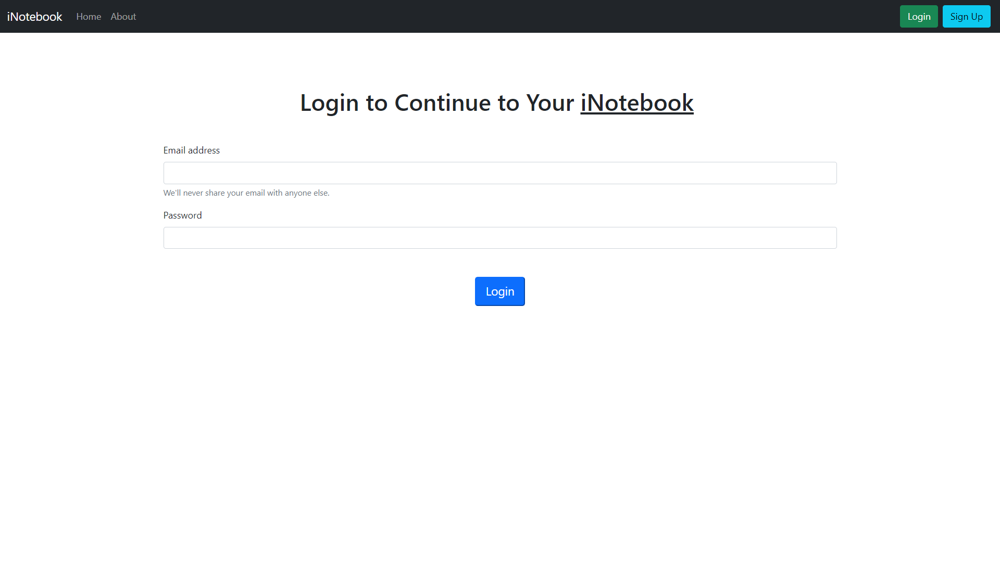
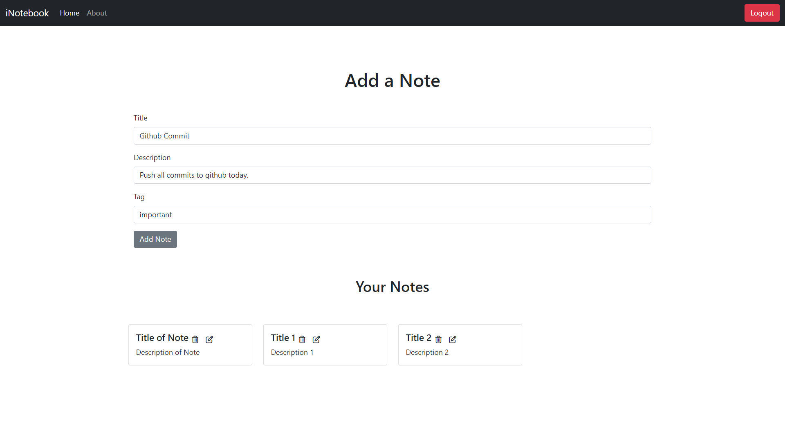
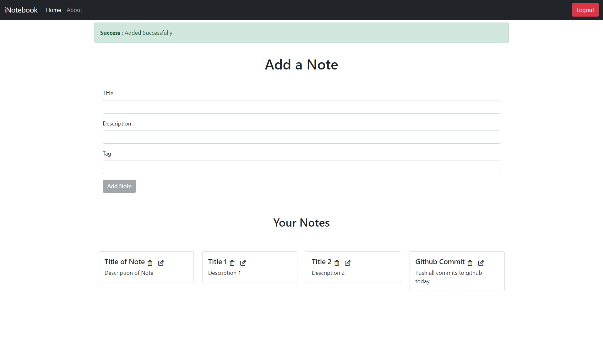
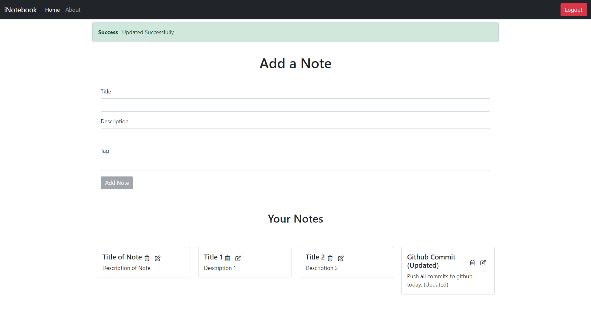
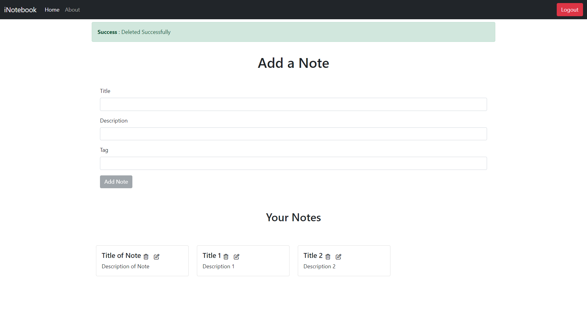

# iNotebook - Secured Notes on Cloud
## **Tech Stack** : 
* HTML
* CSS
* JavaScript
* MongoDb
* Express Js
* Node Js
* React Js
* Bootstrap
* Git / GitHub
___
## **Description** : 
* Stored on cloud
* Secured
* Notes categorised on basis of tags
* Notes can be edited or deleted
* Completely free
___
## **Previews** : 
### Sign Up

### Fill Details

### Login

### Home

### Add a Note


### Edit Note


### Delete Note

___
## **Download Links** : 
You can access my project from your local machine !
>https : https://github.com/anurag203/iNotebook

```bash
    git clone https://github.com/anurag203/iNotebook.git
```
___
